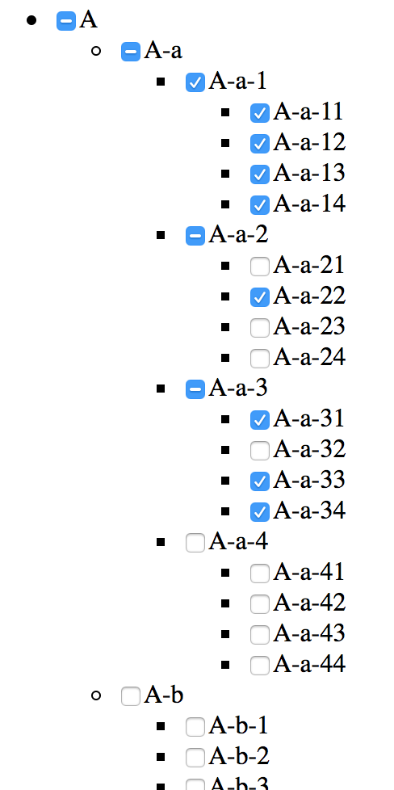

# Checkbox Tree

* `checkbox`を`ul`,`li`タグにてtree状に配置した際にチェック状態を遷移させる．
* `indeterminate`プロパティを用いてmixed状態を表現する．
* 呼び出し方は対象となるcheckbox(input[type=checkbox])をまとめて呼び出す．
	
	id=treeの要素の子孫となるinput全て
	
	```
	$('#tree input').checkboxTree();
	```

	typeにcheckbox属性をもつinput全て
	
	```
	$('input[type=checkbox]').checkboxTree({
		indeterminateState: false,
	});
	```

* optionとして以下を指定できる
	* `afterChange` 変更後に呼び出す関数の指定(function)
	* `indeterminateState` indeterminateプロパティが指定されmixedになっているcheckboxにcheckedを指定するかどうか(boolean)
		* 必然的にmixed状態をclickした際の遷移が変わる．  



## 利用条件

* いかなる種類の使用, 改造, 転載を行っても構いません.
* 改変, 部分的な利用したものはあなたのものになります. 公開するときはあなたの名前の元に公開してください.
* これによるいかなる損害も作者は責任を負わないものとします.